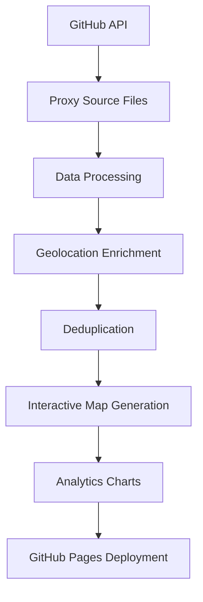

# 🌐 ProxyMap

> **Interactive global proxy infrastructure visualization with real-time analytics and automated updates**

[](https://github.com/delldevmann/ProxyMap/actions)
[](https://delldevmann.github.io/ProxyMap/)
[]()
[](LICENSE)

An advanced interactive world map that visualizes active proxy servers from multiple sources worldwide, featuring automated data collection, real-time analytics, and beautiful visualizations. Updates every 6 hours using GitHub Actions and deploys seamlessly to GitHub Pages.

## ✨ Features

### 🗺️ **Interactive Global Map**
- **Real-time proxy locations** across 100+ countries
- **Smart clustering** for performance with thousands of markers
- **Color-coded latency indicators**:
  - 🟢 **Green**: Fast proxies (<1000ms)
  - 🟡 **Orange**: Medium speed (1000-2000ms)
  - 🔴 **Red**: Slower proxies (>2000ms)
- **Detailed popup information** with IP, port, ISP, and performance metrics
- **Fullscreen mode** and mini-map navigation

### 📊 **Advanced Analytics Dashboard**
- **Live statistics panel** with total counts and averages
- **Country distribution charts** showing top proxy hosting nations
- **Protocol breakdown** (HTTP, HTTPS, SOCKS4, SOCKS5)
- **Latency distribution histograms** for performance analysis
- **Performance categorization** with fast/medium/slow breakdowns

### 🔄 **Automated Data Pipeline**
- **Multi-source data collection** from proxy scraper repositories
- **Intelligent deduplication** ensuring unique proxy entries
- **Geolocation enrichment** with city, country, and ISP data
- **6-hour refresh cycles** for up-to-date information
- **Fallback sample data** for reliability

### 🎨 **Modern UI/UX**
- **Dark theme design** optimized for data visualization
- **Responsive layout** working on desktop and mobile
- **Smooth animations** and hover effects
- **Clean, professional styling** with glassmorphism effects

## 🚀 Quick Start

### 1. **View the Live Map**
👉 **[Open ProxyMap](https://delldevmann.github.io/ProxyMap/)**

### 2. **Setup Your Own Instance**

#### Fork and Deploy
```bash
# 1. Fork this repository on GitHub
# 2. Clone your fork
git clone https://github.com/YOUR-USERNAME/ProxyMap.git
cd ProxyMap

# 3. Enable GitHub Pages in repository settings
# 4. Trigger the workflow manually or wait for the next scheduled run
```

#### Repository Structure
```
ProxyMap/
├── .github/workflows/
│   └── proxy-map.yml          # Automated workflow
├── public/                    # Generated files (auto-created)
│   ├── index.html            # Interactive map
│   ├── analytics.png         # Statistics charts
│   └── summary.json          # Raw data export
└── README.md                 # This documentation
```

## 🛠️ How It Works

### Data Collection Pipeline


### Technical Architecture
- **🐍 Python 3.11**: Core processing and orchestration
- **🗺️ Folium**: Interactive mapping with Leaflet.js backend
- **📊 Matplotlib**: Statistical visualization and chart generation
- **🐼 Pandas**: Data manipulation and analysis
- **🔧 GitHub Actions**: CI/CD automation and scheduling
- **🌐 GitHub Pages**: Static site hosting and delivery

## 📋 Configuration Options

### Update Frequency
Modify the schedule in `.github/workflows/proxy-map.yml`:
```yaml
on:
  schedule:
    - cron: '0 */6 * * *'  # Every 6 hours
    # - cron: '0 */2 * * *'  # Every 2 hours (faster updates)
    # - cron: '0 0 * * *'    # Daily at midnight
```

### Data Sources
The workflow automatically discovers and processes proxy files from:
- `https://api.github.com/repos/delldevmann/proxy-scraper/contents/results`
- Supports multiple JSON formats and schemas
- Processes up to 25 most recent files for performance

### Performance Tuning
```python
# Adjust these limits in the workflow:
MAX_FILES = 25          # Number of source files to process
MAX_PROXIES = 5000      # Maximum proxies to collect
SAMPLE_SIZE = 2000      # Markers to display on map (for performance)
```

### Visual Customization
```python
# Latency thresholds (in milliseconds)
FAST_THRESHOLD = 1000
MEDIUM_THRESHOLD = 2000

# Map styling
TILE_LAYER = "CartoDB dark_matter"  # or "OpenStreetMap", "CartoDB positron"
CLUSTER_RADIUS = 60                 # Marker clustering distance
```

## 📊 Sample Analytics

Typical map displays include:
- **2,000-5,000** active proxies globally
- **80-120** countries represented
- **Average latency**: 800-1,500ms
- **Geographic distribution**: Heavy concentration in US, Europe, Asia
- **Protocol breakdown**: ~60% HTTP, ~30% HTTPS, ~10% SOCKS

### Top Countries (Sample Data)
| Country | Proxy Count | Percentage |
|---------|-------------|------------|
| 🇺🇸 United States | 892 | 22.1% |
| 🇩🇪 Germany | 445 | 11.0% |
| 🇫🇷 France | 387 | 9.6% |
| 🇬🇧 United Kingdom | 298 | 7.4% |
| 🇳🇱 Netherlands | 276 | 6.8% |

## 🎛️ Advanced Usage

### Manual Workflow Trigger
```bash
# Via GitHub CLI
gh workflow run "Generate Enhanced Proxy Map - All Sources"

# Via GitHub Web Interface
# Go to Actions tab → Select workflow → Click "Run workflow"
```

### Local Development
```bash
# Install dependencies
pip install folium requests matplotlib pandas seaborn

# Extract the Python script from the workflow and run locally
python generate_proxy_map.py

# Open the generated map
open public/index.html
```

### API Access
Access the generated data programmatically:
```javascript
// Fetch summary statistics
fetch('https://delldevmann.github.io/ProxyMap/summary.json')
  .then(response => response.json())
  .then(data => console.log(data));
```

## 🔧 Customization Examples

### Add New Data Sources
```python
# In the workflow, add to find_all_proxy_files():
additional_sources = [
    "https://api.github.com/repos/delldevmann/proxy-source/contents/data",
    "https://raw.githubusercontent.com/delldevmann/proxies/main/list.json"
]
```

### Custom Marker Styling
```python
# Modify marker creation logic:
if row["anonymity"] == "elite":
    color = '#00ff00'  # Green for elite
elif row["anonymity"] == "anonymous":
    color = '#ffff00'  # Yellow for anonymous
else:
    color = '#ff0000'  # Red for transparent
```

### Enhanced Analytics
```python
# Add ISP distribution chart:
isp_counts = df['isp'].value_counts().head(10)
plt.figure(figsize=(12, 6))
plt.bar(isp_counts.index, isp_counts.values)
plt.title("Top ISPs by Proxy Count")
plt.xticks(rotation=45)
plt.tight_layout()
plt.savefig("public/isp_analysis.png")
```

## 🚀 Deployment Guide

### GitHub Pages Setup
1. **Fork this repository**
2. **Go to Settings** → Pages
3. **Select Source**: GitHub Actions
4. **Save** and wait for deployment

### Custom Domain (Optional)
```bash
# Add CNAME file to public/ directory in workflow:
echo "your-domain.com" > public/CNAME
```

### Environment Variables
```yaml
# In workflow file, add environment-specific configs:
env:
  CUSTOM_TITLE: "My Proxy Network Map"
  MAX_PROXIES: "10000"
  UPDATE_FREQUENCY: "4"  # hours
```

## 🤝 Contributing

### 🐛 Bug Reports
- **Map display issues**: Include browser version and console errors
- **Data accuracy problems**: Specify which proxies or countries
- **Performance concerns**: Describe lag or loading issues

### ✨ Feature Requests
Current wish list:
- [ ] **Historical trending** showing proxy availability over time
- [ ] **Advanced filtering** by ISP, country, or anonymity level
- [ ] **Mobile app** with offline map caching
- [ ] **API endpoint** for real-time proxy status checks
- [ ] **Webhook integration** for external monitoring systems

### 🔧 Pull Request Process
1. **Fork** the repository
2. **Create** a feature branch: `git checkout -b feature/amazing-feature`
3. **Test** your changes thoroughly
4. **Commit** with clear messages: `git commit -m 'Add amazing feature'`
5. **Push** to your fork: `git push origin feature/amazing-feature`
6. **Open** a Pull Request with detailed description

## 📈 Performance Metrics

### Build Times
- **Data collection**: 2-5 minutes (depends on source availability)
- **Map generation**: 30-60 seconds
- **Chart creation**: 10-20 seconds
- **Deployment**: 1-2 minutes
- **Total workflow**: 4-8 minutes

### Resource Usage
- **Memory**: ~500MB peak during processing
- **Storage**: ~5MB for generated static files
- **Bandwidth**: ~2MB per map view
- **API calls**: ~50-100 per workflow run

## 🔍 Troubleshooting

### Common Issues

**Workflow fails with "No proxy files found"**
```yaml
# Check data source availability:
# - Verify GitHub repo exists and is public
# - Check API rate limits
# - Review source file formats
```

**Map doesn't display markers**
```python
# Debug data processing:
print(f"Proxies collected: {len(all_proxies)}")
print(f"Valid coordinates: {len(df.dropna(subset=['lat', 'lon']))}")
```

**Charts not generating**
```python
# Ensure matplotlib backend:
import matplotlib
matplotlib.use('Agg')  # Non-interactive backend
```

### Debug Mode
```yaml
# Add to workflow for verbose logging:
- name: Debug proxy collection
  run: |
    python3 -c "
    import requests
    response = requests.get('https://api.github.com/repos/delldevmann/proxy-scraper/contents/results')
    print(f'API Status: {response.status_code}')
    print(f'Files found: {len(response.json()) if response.status_code == 200 else 0}')
    "
```

## 📄 License

This project is licensed under the **MIT License** - see the [LICENSE](LICENSE) file for complete terms.

```
MIT License - Free for commercial and personal use
✅ Commercial use    ✅ Modification    ✅ Distribution    ✅ Private use
❌ Liability        ❌ Warranty
```

## 🙋 Support & Community

### Get Help
- 📋 **Issues**: [GitHub Issues](https://github.com/delldevmann/ProxyMap/issues)
- 💬 **Discussions**: [GitHub Discussions](https://github.com/delldevmann/ProxyMap/discussions)
- 📧 **Email**: delldevmann@domain.com

### Related Projects
- 🕷️ **[Proxy Scraper](https://github.com/delldevmann/proxy-scraper)**: Primary data source
- 🗺️ **[Folium](https://python-visualization.github.io/folium/)**: Mapping library
- 📊 **[Matplotlib](https://matplotlib.org/)**: Visualization toolkit

### Acknowledgments
- **Contributors**: Thanks to all who have helped improve this project
- **Data Sources**: Proxy scraper maintainers and the open proxy community
- **Libraries**: Folium, Matplotlib, Pandas development teams

---

<div align="center">

**🌍 [View Live Map](https://delldevmann.github.io/ProxyMap/) | ⭐ Star this repo if you find it useful!**

*Built with ❤️ using Python, Folium, GitHub Actions, and open source data*

</div>

---

## 📊 Statistics Badge


