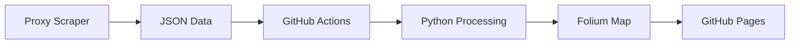

# 🗺️ ProxyMap

> **Interactive global proxy infrastructure visualization with real-time updates**

[](https://github.com/delldevmann/ProxyMap/actions)
[](https://delldevmann.github.io/ProxyMap/)
[]()
[](LICENSE)

An interactive world map that visualizes active proxy servers from the [delldevmann/proxy-scraper](https://github.com/delldevmann/proxy-scraper) project, automatically updated every 6 hours using GitHub Actions and deployed to GitHub Pages.

## 🌟 Features

### 📊 **Real-Time Visualization**
- **Global proxy distribution** across 50+ countries
- **Color-coded latency indicators** (Green: <1000ms, Orange: 1000-2000ms, Red: >2000ms)
- **Interactive markers** with detailed proxy information
- **Country statistics** with top proxy hosting nations

### 🎛️ **Interactive Controls**
- **Fullscreen mode** for detailed exploration
- **Mini-map navigation** for quick positioning
- **Zoom and pan** controls for precise viewing
- **Click-to-reveal** proxy details including IP, ISP, and anonymity level

### 📈 **Data Insights**
- **Live statistics panel** showing total proxies and countries
- **Average latency metrics** for performance overview
- **Country distribution chart** highlighting top proxy locations
- **Real-time update timestamps**

### 🔄 **Automated Updates**
- **6-hour refresh cycle** ensuring fresh data
- **GitHub Actions powered** for reliable automation
- **Zero-maintenance** deployment to GitHub Pages

## 🚀 Quick Start

### View the Live Map
👉 **[Open ProxyMap](https://delldevmann.github.io/ProxyMap/)**

### Understanding the Map
- 🟢 **Green markers**: Fast proxies (<1000ms latency)
- 🟠 **Orange markers**: Medium speed (1000-2000ms latency)  
- 🔴 **Red markers**: Slower proxies (>2000ms latency)
- 📊 **Chart overlay**: Shows top countries by proxy count
- ℹ️ **Info panel**: Displays current statistics

## 🛠️ How It Works

### Data Pipeline


### Technical Stack
- **🐍 Python**: Data processing and map generation
- **🗺️ Folium**: Interactive map creation with Leaflet.js
- **📊 Matplotlib**: Statistical chart generation
- **🔧 GitHub Actions**: Automated workflow execution
- **🌐 GitHub Pages**: Static site deployment

## 📋 Project Structure

```
ProxyMap/
├── .github/workflows/
│   └── proxy-map.yml          # GitHub Actions workflow
├── public/                    # Generated output (auto-created)
│   ├── index.html            # Interactive map
│   └── country_chart.png     # Statistics chart
└── README.md                 # This file
```

## ⚙️ Configuration

### Workflow Schedule
- **Automatic**: Every 6 hours via cron (`0 */6 * * *`)
- **Manual**: Trigger via GitHub Actions tab

### Data Source
The map pulls data from: `https://raw.githubusercontent.com/delldevmann/proxy-scraper/main/results/summary_latest.json`

### Map Settings
- **Tile Layer**: CartoDB Positron (clean, minimal design)
- **Default View**: Global overview with auto-centered positioning
- **Marker Size**: 6px radius for optimal visibility
- **Popup Width**: 300px for detailed information display

## 🎨 Customization

### Modify Update Frequency
Edit the cron schedule in `.github/workflows/proxy-map.yml`:
```yaml
schedule:
  - cron: '0 */6 * * *'  # Change to desired interval
```

### Adjust Latency Thresholds
Modify color coding logic in the workflow:
```python
color = 'green' if row["latency"] < 1000 else 'orange' if row["latency"] < 2000 else 'red'
```

### Customize Chart Display
Change the number of countries shown:
```python
top_countries = df["country"].value_counts().nlargest(8)  # Adjust number
```

## 📊 Statistics

The map typically displays:
- **500-1000+** active proxies globally
- **40-60** countries represented
- **Sub-second** to **10+ second** latency ranges
- **Multiple anonymity levels** (Elite, Anonymous, Transparent)

## 🔧 Development

### Local Development
```bash
# Clone the repository
git clone https://github.com/delldevmann/ProxyMap.git
cd ProxyMap

# Install dependencies
pip install folium requests matplotlib pandas

# Run the map generation script
python generate_map.py  # (extract from workflow)
```

### Testing Changes
1. Fork the repository
2. Modify the workflow file
3. Push changes to trigger the action
4. Check the Actions tab for build status
5. View results at `https://yourusername.github.io/ProxyMap/`

## 🤝 Contributing

We welcome contributions! Here's how you can help:

### 🐛 Bug Reports
- Report issues with map display or data accuracy
- Include browser information and screenshots

### ✨ Feature Requests  
- Suggest new visualization features
- Propose additional data sources or metrics

### 🔧 Pull Requests
1. Fork the repository
2. Create a feature branch (`git checkout -b feature/amazing-feature`)
3. Commit changes (`git commit -m 'Add amazing feature'`)
4. Push to branch (`git push origin feature/amazing-feature`)
5. Open a Pull Request

## 📈 Roadmap

### Planned Features
- [ ] **Historical data trends** and proxy stability metrics
- [ ] **Advanced filtering** by country, ISP, or anonymity level
- [ ] **Performance analytics** with response time distributions
- [ ] **API endpoint** for programmatic access to map data
- [ ] **Mobile-optimized** responsive design improvements

### Possible Enhancements
- [ ] **Heatmap overlay** showing proxy density
- [ ] **Connection testing** from multiple geographic locations
- [ ] **Proxy type classification** (HTTP, HTTPS, SOCKS)
- [ ] **Integration** with other proxy sources

## 📄 License

This project is licensed under the **MIT License** - see the [LICENSE](LICENSE) file for details.

## 🙋 Support

### Questions or Issues?
- 📋 **Issues**: [GitHub Issues](https://github.com/delldevmann/ProxyMap/issues)
- 💬 **Discussions**: [GitHub Discussions](https://github.com/delldevmann/ProxyMap/discussions)

### Related Projects
- 🕷️ **[Proxy Scraper](https://github.com/delldevmann/proxy-scraper)**: Data source for this visualization
- 🗺️ **[Folium Documentation](https://python-visualization.github.io/folium/)**: Mapping library used

---

<div align="center">

**🌍 [View Live Map](https://delldevmann.github.io/ProxyMap/) | ⭐ Star this repo if you find it useful!**

*Built with ❤️ using Python, Folium, and GitHub Actions*

</div>
